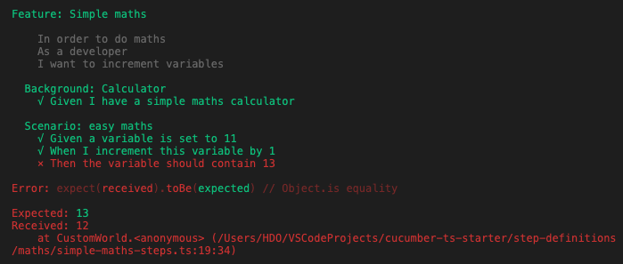

# cucumber-console-formatter

[](https://travis-ci.org/hdorgeval/cucumber-console-formatter)
[](https://ci.appveyor.com/project/hdorgeval/cucumber-console-formatter)
[](https://www.npmjs.com/package/cucumber-console-formatter)

A simple console formatter for Cucumber.js v7



## To install this console formatter

- run the command:

  ```sh
  npm install --save cucumber-console-formatter
  ```

## Usage

- add to the cucumber-js command-line the following option:

  ```sh
  --format cucumber-console-formatter
  ```
